 

Software engineer in Sydney, working on design systems, testing and the tools around them, in React and TypeScript with accessibility built in.

Get in touch about projects in design systems, design engineering or frontend.

<a href="mailto:hipuku.dev@gmail.com">hipuku.dev@gmail.com</a> &nbsp;·&nbsp;
<a href="https://www.hipuku.dev">hipuku.dev</a> &nbsp;·&nbsp;
<a href="https://www.figma.com/@hipuku">Figma</a>

 

<a href="https://www.hipuku.dev/work/haus">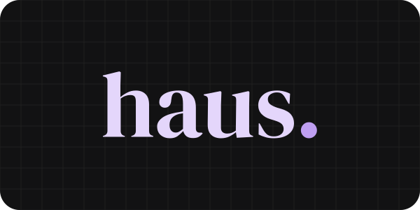</a>

**A token-first React design system.** W3C DTCG tokens in OKLCH, 20 accessible components and five packages on npm.

[Storybook](https://haus.hipuku.dev) · [Source](https://github.com/hipuku/haus) · [Case study](https://www.hipuku.dev/work/haus)

 
 

<a href="https://www.hipuku.dev/work/drift">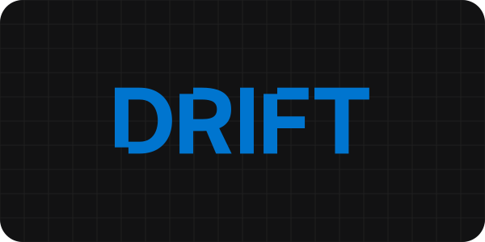</a>

**A design-system auditor for live websites.** Crawls a site and reports every colour, type size, spacing step, radius and shadow it ships, deduplicated with CIEDE2000.

[Demo](https://drift.hipuku.dev) · [Source](https://github.com/hipuku/drift) · [BDD tests](https://github.com/hipuku/drift-tests) · [Case study](https://www.hipuku.dev/work/drift)

 
 

<a href="https://www.hipuku.dev/work/core">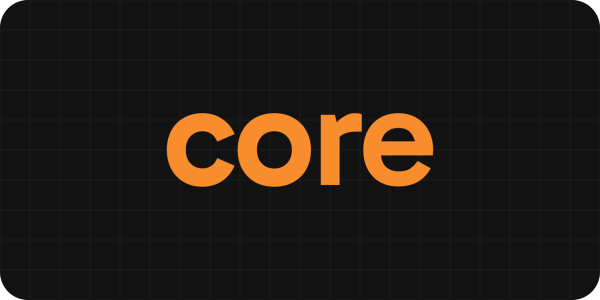</a>

**A team decision log.** ADRs with a permission-gated lifecycle, two audit trails, and GitHub citations that report when the cited code changes.

[Demo](https://core.hipuku.dev) · [Source](https://github.com/hipuku/core) · [Case study](https://www.hipuku.dev/work/core)

 
 

<a href="https://www.hipuku.dev/work/vault">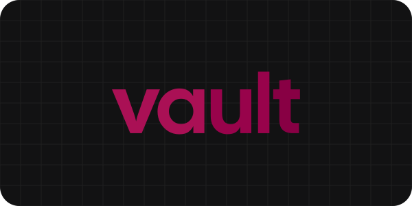</a>

**An offline Mac app for colours, fonts, palettes and type scales.** Electron, React and SQLite, with a typed IPC boundary.

[Download](https://github.com/hipuku/vault/releases/latest) · [Source](https://github.com/hipuku/vault) · [Case study](https://www.hipuku.dev/work/vault)

 
 

<a href="https://www.hipuku.dev/work/kern">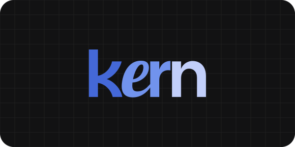</a>

**The component library behind the tools below.** 38 components and one token source, distributed as TypeScript source at a pinned git tag.

[Storybook](https://kern.hipuku.dev) · [Source](https://github.com/hipuku/kern) · [Case study](https://www.hipuku.dev/work/kern)

 
 

Free, in the browser, no sign-up, MIT licensed.

 

<a href="https://tokenise.hipuku.dev">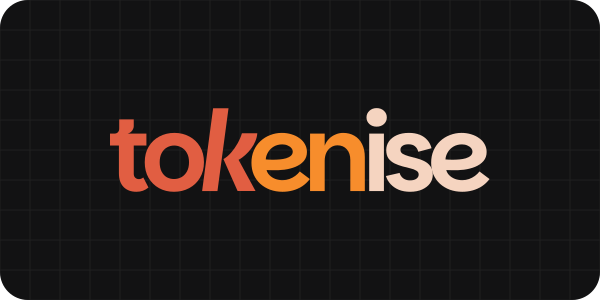</a>

**Converts design tokens** between DTCG, Figma variables, Tokens Studio and Tailwind v4, and reports what each format changes or drops.

[Open](https://tokenise.hipuku.dev) · [Source](https://github.com/hipuku/tokenise)

 
 

<a href="https://specifi.hipuku.dev">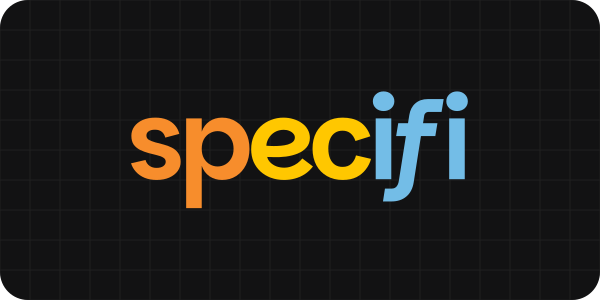</a>

**CSS specificity, token by token,** on a from-scratch Selectors Level 4 parser. Compares two selectors or ranks a whole stylesheet.

[Open](https://specifi.hipuku.dev) · [Source](https://github.com/hipuku/specifi)

 
 

<a href="https://hexicon.hipuku.dev">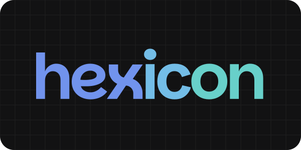</a>

**Perceptual colour tools.** Names any hex by CIEDE2000, maps a palette in OKLCH, and checks WCAG contrast for every pair.

[Open](https://hexicon.hipuku.dev) · [Source](https://github.com/hipuku/hexicon)

 
 

<a href="https://gray-scott.hipuku.dev">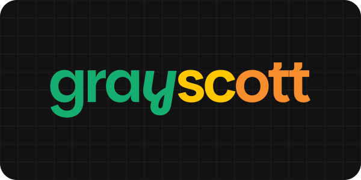</a>

**Real-time reaction-diffusion.** A Gray-Scott simulation run in a Web Worker, with presets and Pearson's map of pattern types.

[Open](https://gray-scott.hipuku.dev) · [Source](https://github.com/hipuku/gray-scott)

 
 

Motion and interaction techniques from client work, each shown beside its code. Select one to try it live.

 

<a href="https://www.hipuku.dev/snippets#velocity-marquee">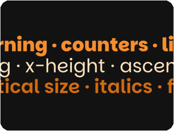</a>
&nbsp;<a href="https://www.hipuku.dev/snippets#shape-pit">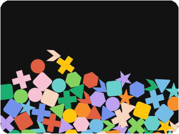</a>
&nbsp;<a href="https://www.hipuku.dev/snippets#text-scramble">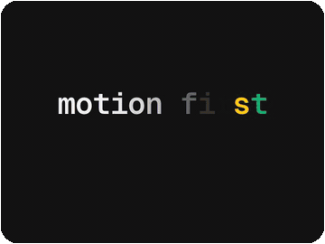</a>

<a href="https://www.hipuku.dev/snippets#cloth-pluck">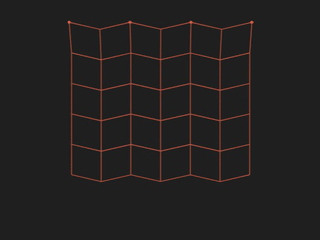</a>
&nbsp;<a href="https://www.hipuku.dev/snippets#metaballs">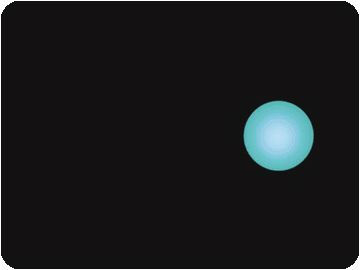</a>
&nbsp;<a href="https://www.hipuku.dev/snippets#path-editor">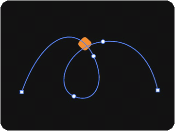</a>

 

- [The Language We Never Agreed On](https://www.hipuku.dev/writing/the-language-we-never-agreed-on): why four design token formats overlap and still disagree.
- [The Default Is Not a Design Decision](https://www.hipuku.dev/writing/the-default-is-not-a-design-decision): why so many products built from the same defaults look alike.
- [Motion Deserves Better Than a Prop](https://www.hipuku.dev/writing/motion-deserves-better-than-a-prop): motion as the one design medium that exists in time.

 

Before this: front-end and test automation on a workflow-automation and messaging platform (React and TypeScript features, a Cucumber BDD regression suite, K6 canary and load tests, GitHub Actions), custom websites for clients, from brief to launch, and [maple](https://maple-demo.hipuku.dev), an app where a design studio keeps its clients' brands. Design and development work has won Indigo Awards Gold for Website Design (2024, 2026) and Mobile App (2025).

On npm: [haus-tokens](https://www.npmjs.com/package/haus-tokens) · [haus-components](https://www.npmjs.com/package/haus-components) · [haus-colour-utils](https://www.npmjs.com/package/haus-colour-utils) · [haus-colour-names](https://www.npmjs.com/package/haus-colour-names) · [haus-style-probe](https://www.npmjs.com/package/haus-style-probe)
