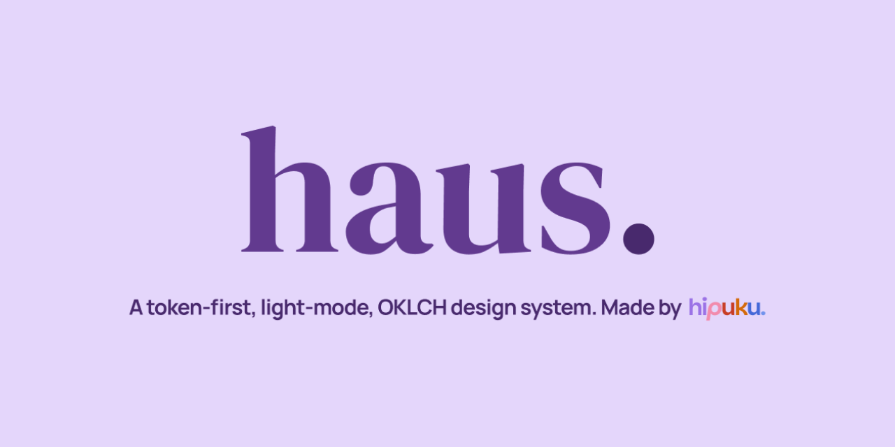
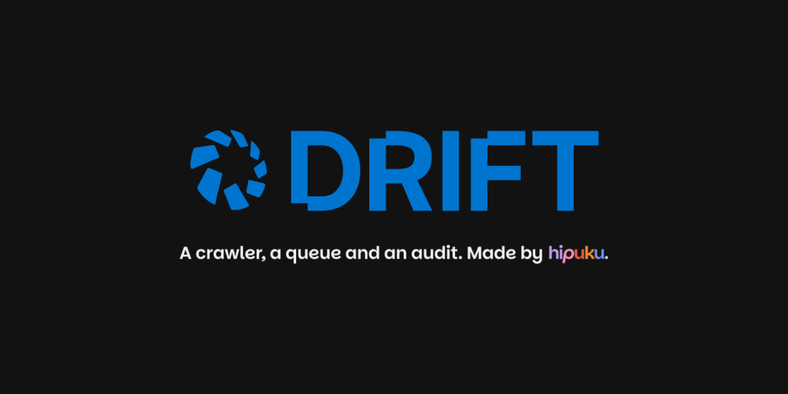
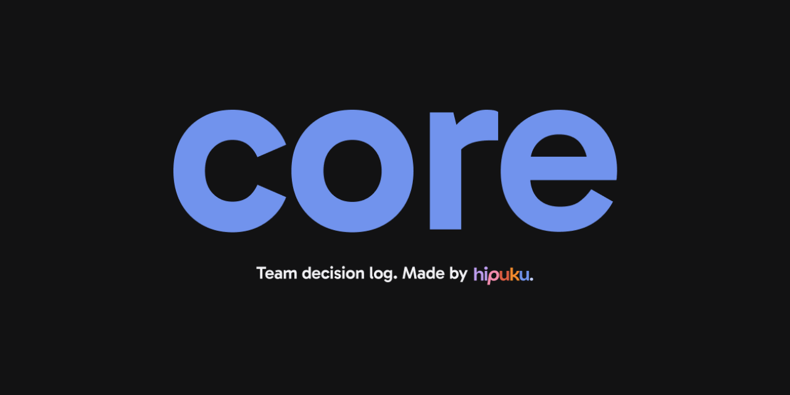
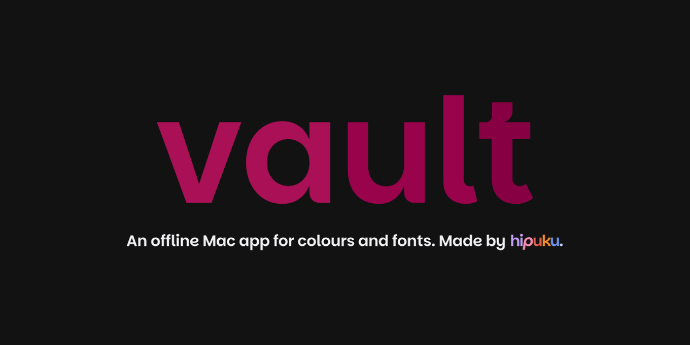
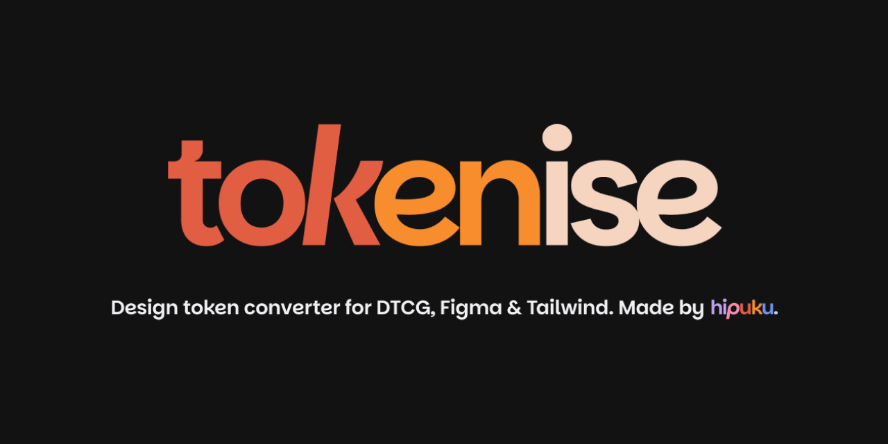
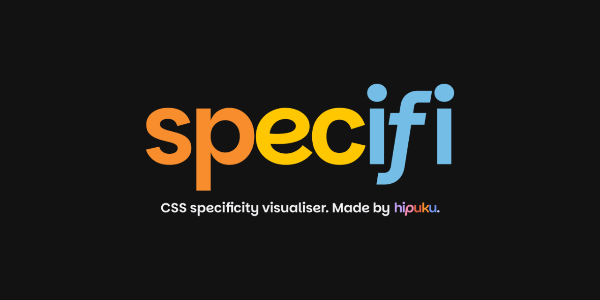
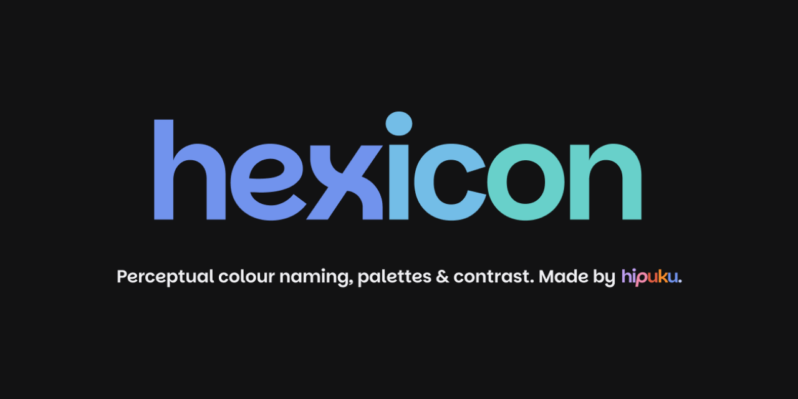
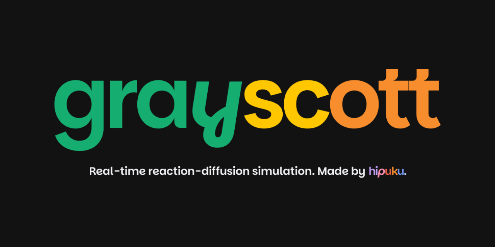

Software engineer in Sydney, working on design systems, testing and the tools around them, 
in React and TypeScript with accessibility built in. Open to roles in design systems, design engineering and frontend.

<a href="https://www.hipuku.dev">hipuku.dev</a> ·
<a href="mailto:hipuku.dev@gmail.com">hipuku.dev@gmail.com</a> ·
<a href="https://www.figma.com/@hipuku">Figma</a>

## Systems

<table>
<tr>
<td width="50%" valign="top">

A token-first React design system: W3C DTCG tokens in OKLCH, 20 accessible components and five packages on npm.

<a href="https://haus.hipuku.dev">Storybook</a> · <a href="https://github.com/hipuku/haus">Source</a> · <a href="https://www.hipuku.dev/work/haus">Case study</a>
</td>
<td width="50%" valign="top">

Crawls a website and reports the design values it ships, deduplicated with CIEDE2000 and attributed to the pages that use them. Its HTTP API is covered by a black-box BDD suite.

<a href="https://drift.hipuku.dev">Demo</a> · <a href="https://github.com/hipuku/drift">Source</a> · <a href="https://github.com/hipuku/drift-tests">Tests</a> · <a href="https://www.hipuku.dev/work/drift">Case study</a>
</td>
</tr>
<tr>
<td width="50%" valign="top">

A team decision log: ADRs with a permission-gated lifecycle, two audit trails, and GitHub citations that report when the cited code changes.

<a href="https://core.hipuku.dev">Demo</a> · <a href="https://github.com/hipuku/core">Source</a> · <a href="https://www.hipuku.dev/work/core">Case study</a>
</td>
<td width="50%" valign="top">

An offline Mac app for colours, fonts, palettes and type scales. Electron, React and SQLite, with a typed IPC boundary.

<a href="https://github.com/hipuku/vault/releases/latest">Download</a> · <a href="https://github.com/hipuku/vault">Source</a> · <a href="https://www.hipuku.dev/work/vault">Case study</a>
</td>
</tr>
</table>

## Tools

Free, in the browser, no sign-up, MIT licensed.

<table>
<tr>
<td width="50%" valign="top">

Converts design tokens between DTCG, Figma variables, Tokens Studio and Tailwind v4, and reports every token each format changes or drops.

<a href="https://tokenise.hipuku.dev">Open</a> · <a href="https://github.com/hipuku/tokenise">Source</a>
</td>
<td width="50%" valign="top">

CSS specificity, token by token, on a from-scratch Selectors Level 4 parser.

<a href="https://specifi.hipuku.dev">Open</a> · <a href="https://github.com/hipuku/specifi">Source</a>
</td>
</tr>
<tr>
<td width="50%" valign="top">

Names any hex by CIEDE2000, maps a palette in OKLCH and draws a WCAG contrast matrix for every pair.

<a href="https://hexicon.hipuku.dev">Open</a> · <a href="https://github.com/hipuku/hexicon">Source</a>
</td>
<td width="50%" valign="top">

Real-time Gray-Scott reaction-diffusion, simulated in a Web Worker.

<a href="https://gray-scott.hipuku.dev">Open</a> · <a href="https://github.com/hipuku/gray-scott">Source</a>
</td>
</tr>
</table>

All four are built on **[kern](https://github.com/hipuku/kern)**, a component library and token
set distributed as TypeScript source at a pinned git tag.
[Storybook](https://kern.hipuku.dev) · [Case study](https://www.hipuku.dev/work/kern)

## Motion and creative coding

Sixteen live, interactive demos of techniques from client work: physics integrated by hand,
canvas particle systems, variable-font type and GSAP. Each one shows its code beside it.
[See them all on hipuku.dev/snippets](https://www.hipuku.dev/snippets)

<table>
<tr>
<td valign="top">Physics Cloth pluck Flocking Shape pit Spring drag</td>
<td valign="top">Canvas Flow field Iron filings Ripple grid</td>
<td valign="top">Type Text pressure Text scramble Velocity marquee</td>
<td valign="top">GSAP Card fan MotionPath Parallax tilt Path editor</td>
<td valign="top">SVG Metaballs Text loop</td>
</tr>
</table>

## On npm

[haus-tokens](https://www.npmjs.com/package/haus-tokens) ·
[haus-components](https://www.npmjs.com/package/haus-components) ·
[haus-colour-utils](https://www.npmjs.com/package/haus-colour-utils) ·
[haus-colour-names](https://www.npmjs.com/package/haus-colour-names) ·
[haus-style-probe](https://www.npmjs.com/package/haus-style-probe)

 

<table>
<tr>
<td width="50%" valign="top">
Work

Software engineer at Pendula, 2023 to 2025, on a workflow-automation and messaging platform: React and TypeScript features, a Cucumber BDD regression suite, K6 canary and load tests, and the GitHub Actions around them. <a href="https://www.hipuku.dev/work/pendula">Case study</a>

Co-founder of three55 studio: custom websites, and maple, the studio's app for its clients' brand assets. <a href="https://maple-demo.hipuku.dev">Read-only demo</a>

Design and development work has won Indigo Awards Gold for Website Design (2024, 2026) and Mobile App (2025).

</td>
<td width="50%" valign="top">
Writing

<a href="https://www.hipuku.dev/writing/the-language-we-never-agreed-on">The Language We Never Agreed On</a> 
<a href="https://www.hipuku.dev/writing/the-default-is-not-a-design-decision">The Default Is Not a Design Decision</a> 
<a href="https://www.hipuku.dev/writing/motion-deserves-better-than-a-prop">Motion Deserves Better Than a Prop</a>

</td>
</tr>
</table>
