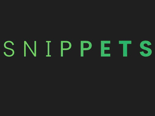
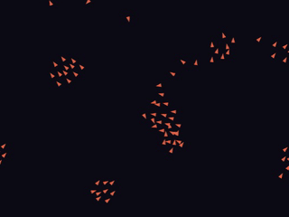

Software engineer in Sydney, working on design systems, testing and the tools around them, in React and TypeScript with accessibility built in. Open to roles in design systems, design engineering and frontend.

<a href="https://www.hipuku.dev">hipuku.dev</a> ·
<a href="mailto:hipuku.dev@gmail.com">hipuku.dev@gmail.com</a> ·
<a href="https://www.figma.com/@hipuku">Figma</a>

 

## Systems

- **haus**: a token-first React design system. W3C DTCG tokens in OKLCH, 20 accessible components, five packages on npm. [Storybook](https://haus.hipuku.dev) · [Source](https://github.com/hipuku/haus)
- **drift**: crawls a website and reports the design values it ships, deduplicated with CIEDE2000 and attributed to the pages that use them. [Demo](https://drift.hipuku.dev) · [Source](https://github.com/hipuku/drift) · [BDD tests](https://github.com/hipuku/drift-tests)
- **core**: a team decision log. ADRs with a permission-gated lifecycle, two audit trails, and GitHub citations that report when the cited code changes. [Demo](https://core.hipuku.dev) · [Source](https://github.com/hipuku/core)
- **vault**: an offline Mac app for colours, fonts, palettes and type scales. Electron, React, SQLite. [Download](https://github.com/hipuku/vault/releases/latest) · [Source](https://github.com/hipuku/vault)

Each card opens its case study on hipuku.dev.

## Tools

- **tokenise**: converts design tokens between DTCG, Figma variables, Tokens Studio and Tailwind v4, and reports what each format changes or drops. [Source](https://github.com/hipuku/tokenise)
- **specifi**: CSS specificity, token by token, on a from-scratch Selectors Level 4 parser. [Source](https://github.com/hipuku/specifi)
- **hexicon**: names any hex by CIEDE2000, maps a palette in OKLCH, and checks WCAG contrast for every pair. [Source](https://github.com/hipuku/hexicon)
- **gray-scott**: real-time reaction-diffusion, simulated in a Web Worker. [Source](https://github.com/hipuku/gray-scott)

Free, in the browser, MIT licensed, and built on [kern](https://github.com/hipuku/kern), a component library distributed as TypeScript source at a pinned git tag ([Storybook](https://kern.hipuku.dev)).

## Motion

Six of the sixteen interactive demos at [hipuku.dev/snippets](https://www.hipuku.dev/snippets): physics integrated by hand, canvas fields, variable-font type, SVG filters and GSAP, each shown beside its code.

 

---

Before this: front-end and test automation on a workflow-automation and messaging platform (React and TypeScript features, a Cucumber BDD regression suite, K6 canary and load tests, GitHub Actions), custom websites for clients, from brief to launch, and [maple](https://maple-demo.hipuku.dev), an app where a design studio keeps its clients' brands. Design and development work has won Indigo Awards Gold for Website Design (2024, 2026) and Mobile App (2025).

Writing: [The Language We Never Agreed On](https://www.hipuku.dev/writing/the-language-we-never-agreed-on) · [The Default Is Not a Design Decision](https://www.hipuku.dev/writing/the-default-is-not-a-design-decision) · [Motion Deserves Better Than a Prop](https://www.hipuku.dev/writing/motion-deserves-better-than-a-prop)

npm: [haus-tokens](https://www.npmjs.com/package/haus-tokens) · [haus-components](https://www.npmjs.com/package/haus-components) · [haus-colour-utils](https://www.npmjs.com/package/haus-colour-utils) · [haus-colour-names](https://www.npmjs.com/package/haus-colour-names) · [haus-style-probe](https://www.npmjs.com/package/haus-style-probe)
